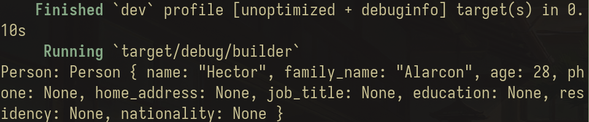
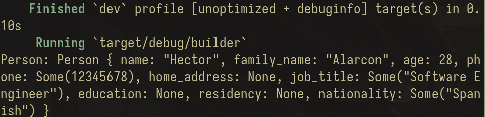
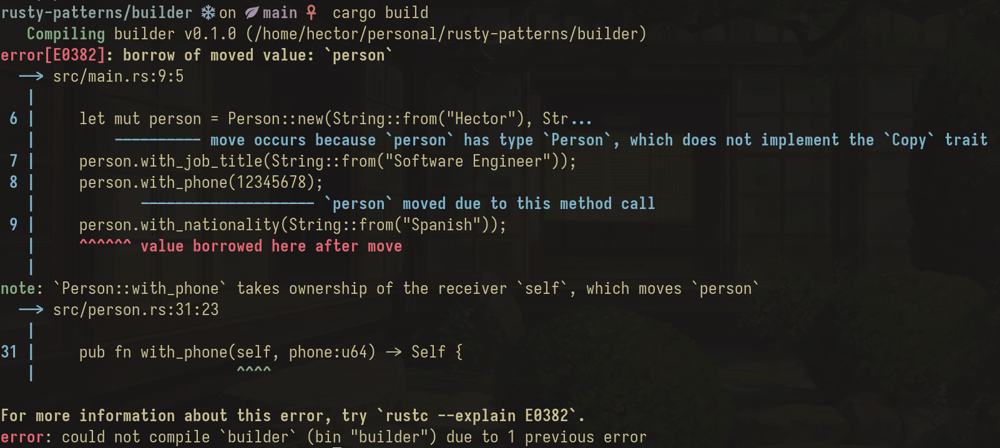
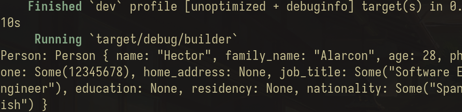

# Builder Pattern

The builder pattern is an old and popular pattern from the [Gang of 4 book](https://www.amazon.es/Design-Patterns-Object-Oriented-professional-computing/dp/0201633612). The builder pattern is implemented the same way in Rust as it is implemented in most of programming languages.

But, let's explain why we need the builder pattern and implement it ourselves. Let's begin with a simple problem. We want to model the identity of a person. Let's implement it.

```Rust person.rs
#[derive(Debug)]
struct Person {
    // To make things simple I'll use String instead of &str, but you might want to consider using &str instead.
    name: String,
    family_name: String,
    age: u8,
    phone: u64,
    home_address: String,
    job_title: String,
    education: String,
    residency: String,
    nationality: String,
    // Depending on what exactly we are modelling this struct can get MUCH bigger.
}
```

As mentioned, depending on what we need for our application the struct can become much much bigger. And so if we implement the constructor for the struct we end up with:
```Rust person.rs
impl Person {
    // Rust's idiomatic constructor name is called `new`
    fn new(name: String, family_name: String, age: u8, phone: u64, home_address: String, relantionship_status: RelantionshipStatus, job_title: String, education: String, residency: String, nationality: String) -> Self {
        Self {
            name,
            family_name,
            age,
            phone,
            home_address,
            job_title,
            education,
            residency,
            nationality
        }
    }
}
```

Well, that does not look well. And moreover, do we really need all of those parameters to construct a `Person`. What happens if for whatever reason the user does not provide or have any of them? Its `Option` time! Most of the parameters are Optional in most of the implementations. In our application we don't need that much information to be required. Let's reflect it:
```Rust person.rs
#[derive(Debug)]
struct Person {
    name: String,
    family_name: String,
    age: u8,
    phone: Option<u64>,
    home_address: Option<String>,
    job_title: Option<String>,
    education: Option<String>,
    residency: Option<String>,
    nationality: Option<String>,
}
```

Okay okay, that looks better. The only required parameters are `name`, `family_name` and `age`, the rest is optional. Let's see how the constructor looks now.

```Rust person.rs
impl Person {
    fn new(
        name: String, 
        family_name: String, 
        age: u8,
        phone: Option<u64>,
        home_address: Option<String>,
        job_title: Option<String>,
        education: Option<String>,
        residency: Option<String>, 
        nationality: Option<String>
    ) -> Self {
        Self {
            name,
            family_name,
            age,
            phone,
            home_address,
            job_title,
            education,
            residency,
            nationality
        }
    }
}
```

Well, that did not change. And how does it look when creating a new person instance?
```Rust main.rs
mod person;
use crate::person::Person;

fn main () {
    let person = Person::new(
            String::from("Hector"),
            String::from("Alarcon"),
            28,
            None,
            None,
            None,
            None,
            None,
            None
    );
    println!("Person: {:?}", person);
}
```

Running the program prints the following:


Isn't that horrible? We need to specify everything! That does not look like it scales good. In fact, what we want is to specify only the required parameters in the creation of the person, and if the user has filled other information we add it accordingly. How can we do that? Well, let's introduce the `Builder` pattern. Instead of specifying everything, we implement methods for each parameter. Think about it like a constructor-setter. Let's see it in action.

```Rust person.rs
impl Person {
    fn new(name: String, family_name: String, age: u8) -> Self {
        Self {
            name,
            family_name,
            age,
            ..Default::default()
        }
    }
}
```

In our main function we have:
```Rust main.rs
mod person;
use crate::person::Person;

fn main() {
    let person = Person::new(String::from("Hector"), String::from("Alarcon"), 29);

    println!("Person: {:?}", person);
}
```

That's okay, but how do we modify the other values? Right, let's implement the methods that act like setters for the person.
```Rust person.rs
impl Person {
    // (...)
    pub fn with_phone(&mut self, phone:u64) { self.phone = Some(phone); }
    pub fn with_home_address(&mut self, home_address : String) { self.home_address = Some(home_address);}
    pub fn with_job_title(&mut self, job_title: String) { self.job_title = Some(job_title); }
    pub fn with_education(&mut self, education: String) { self.education = Some(education); }
    pub fn with_residency(&mut self, residency: String) { self.residency = Some(residency); }
    pub fn with_nationality(&mut self, nationality: String) { self.nationality = Some(nationality); }
}
```

That is much better. Now we can change anything from the person struct whenever we need it. See it yourself:

```Rust main.rs
mod person;
use crate::person::Person;

fn main(){
    let mut person = Person::new(String::from("Hector"), String::from("Alarcon"), 28);
    person.with_job_title(String::from("Software Engineer"));
    person.with_phone(12345678);
    person.with_nationality(String::from("Spanish"));

    println!("Person: {:?}", person);
} 
```

Running the program now prints the following:


Cool! Now we can modify a person's phone explicitly. But every modification is on a different line. Is there any way to make it one-liner? Yes, and it is an extension of the `Builder` pattern called the `Fluent` pattern. In the `Fluent` pattern instead of accepting a mutable reference, we own the self and return a new self with that parameter modified. Let's see the implementation now.

```Rust person.rs

impl Person {
    // (...)
    pub fn with_phone(self, phone:u64) -> Self { 
        Self { 
            phone: Some(phone), 
           ..self  // moving everything from self to the new Self
        }
    }
}
```

But if we try to run now the same main as before we get the following error:



That makes sense. Now `with_..` methods consume the object and spits out a new one, so we need to re-assing it.
```Rust main.rs
mod person;
use crate::person::Person;

fn main(){
    let mut person = Person::new(String::from("Hector"), String::from("Alarcon"), 28);
    person = person.with_job_title(String::from("Software Engineer"));
    person = person.with_phone(12345678);
    person = person.with_nationality(String::from("Spanish"));

    println!("Person: {:?}", person);
}
```

Wait, isn't that worse? Well, it depends. The nice thing about the `Fluent` pattern is the ability to make the code explicit in a single line. See it yourself:
```Rust main.rs
mod person;
use crate::person::Person;

fn main() {
    // We don't need `mut` anymore!
    let person = Person::new(String::from("Hector"), String::from("Alarcon"), 28)
        .with_job_title(String::from("Software Engineer"))
        .with_phone(12345678)
        .with_nationality(String::from("Spanish"));

    println!("Person: {:?}", person);
}

```


And that works as expected:


But to be honest, I lied. The `Fluent` pattern is not an extension of the `Builder` pattern. It is a pattern in its own, but it is so popularly used in conjuction with the `Builder` pattern that it's not so strange to see it called an extension of it.

The `Fluent` pattern is the style of code where developers create an entire new object with the needed changes. It is heavily inspired by the functional programming style. The previous object doesn't have to be destroyed, but in Rust it feels natural to consume it.


And that's it! 
As always, if you want to see the pattern in use I highly recommend checking out the [`Command` implementation in the standard library](https://doc.rust-lang.org/std/process/struct.Command.html). It's one of the best Rust resources for understanding the `Builder` and `Fluent` patterns all at once.


Thanks for reading! I hope you enjoyed and learnt something along the way.


