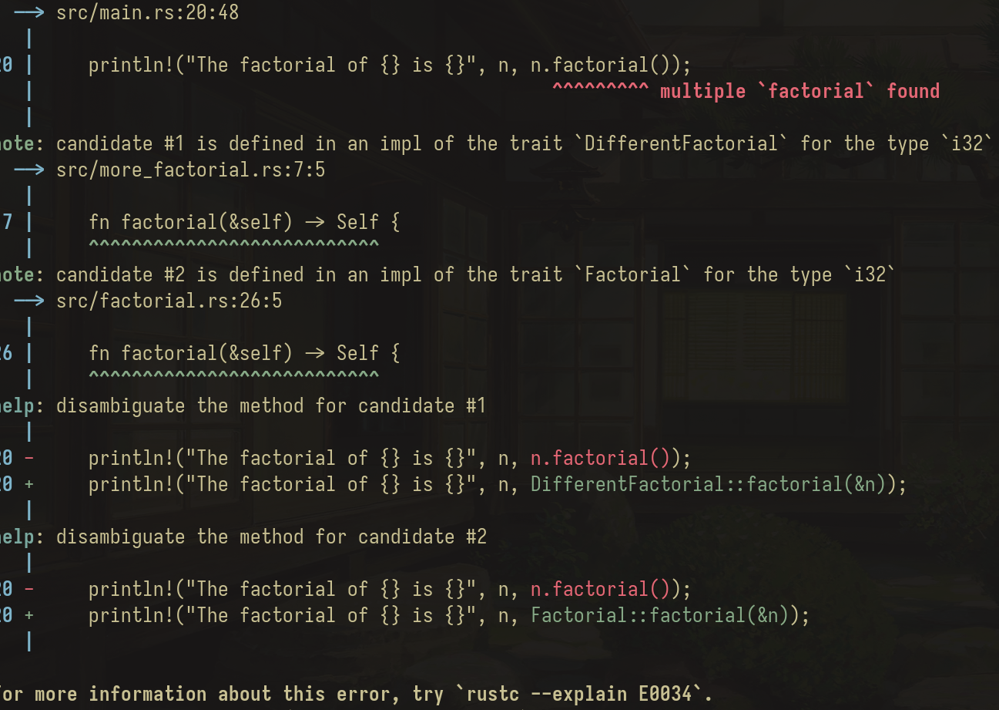

# Extension Traits
Extension Traits is probably the most amazing feature I've ever seen in a programming language. Simply put, it allows the introduction of methods to any data type. Yes, any data type. Extension traits works by using `traits`. These traits can be defined for external and internal data types. Once the trait is imported that type gains access to the methods defined in there.


Maybe an example can illustrate this much better. Let's start with simple one. In some languages such as Spanish, exclamation marks requires the inverse symbol `¡` at the beggining and `!` at the end.
The most straight forward approach would be to just add it:

```Rust

let mut hola: String = "Hola".into();
hola.insert(0, '¡');
hola.push('!');
```

And that works! Yay! Easy right? The problem comes if we need to do it many times throughout the codebase. The next solution would be to implement a function that accepts a mutable string and inserts the exclamation marks. As such:

```Rust
fn exclamation_in_spanish(&mut s: String) {
    s.insert(0, '¡');
    s.push('!');
}
```

And again that works. But I don't think that's the Rust way of doing things. Rust is incredible powerful, and the power comes from its algebraic data types, simply put the Struct and Enums (tagged unions), and the compiler's reassurance of states during compilation time.

And for that, we have another alternative. We can implement the `exclamation_in_spanish` function directly into the `String` type. What? Is this even allowed? YES, and it is called `Extension Trait`. The only requisite for it to be used is that the trait is imported. Once it is imported, we get the method as it always has been there.

First, let's define the trait: 
```Rust urgency.rs
// src/urgency.rs
pub trait Urgency {
    fn urgency_in_spanish(&mut self); 
}
```


Now, let's implement it:
```Rust urgency.rs
// src/urgency.rs after the trait declaration

// Implemtend for the `String` data type!
impl Urgency for String {
    // Same function as above but we accept a mutable self
    fn urgency_in_spanish(&mut self) {
        self.insert(0, '¡');
        self.push('!');
    }
}
```

Now, in our main function we can import the trait and use it!
```Rust main.rs
// src/main.rs

mod urgency;

// Don't forget to import the trait
use crate::urgency::Urgency;

fn main() {
    // Why does `Hola amigos` sound like I don't know Spanish?
    let mut hello = String::from("Hola amigos");
    hello.urgency_in_spanish();
    println!("{}", hello); // It prints: ¡Hola amigos!
}
```

To me this feels amazing. Let's see another example. Let's say we want to implement the factorial of a number. How can we do that? Well, we can do it as an extension trait of an `i32`. Check it out

```Rust factorial.rs
// src/factorial.rs

pub trait Factorial {
    fn factorial(&self) -> Self;
}


impl Factorial for i32 {
    fn factorial(&self) -> Self {
        let mut res = 1;
        for n in 1..(*self + 1) { res *= n }
        res
    }
}
```

And now, we can use it anywhere the trait is imported. 
```Rust main.rs
mod factorial;

// Importing a Trait to add methods! 
use crate::factorial::Factorial;

fn main() {
    for n in 1..10 {
        println!("The factorial of {} is {}", n, n.factorial());
    }
}
```


But what happens if two exact functions are implemented in different traits for the same type? Like, maybe the function `factorial(&self) -> Self` is already implemented in a different crate. What would happen?

Let's try it out. Let's implement the factorial trait in a different crate.
```Rust more_factorial.rs
// src/more_factorial.rs

pub trait DifferentFactorial {
    // Same function definition.
    // If anything would be different there would be no collision!
    fn factorial(&self) -> Self;
}

impl DifferentFactorial for i32 {
    fn factorial(&self) -> Self {
        let mut res: Self = 1;
        for n in *self..0 {
            res *= n
        }
        res
    }
} 
```


And now in our main function we import the other factorial crate too.

```Rust main.rs
// src/main.rs

mod factorial;
mod more_factorial;

use crate::factorial::Factorial;
use crate::more_factorial::DifferentFactorial;

fn main() {
    let n = 10;
    
    println!("{}", hello);
    println!("The factorial of {} is {}", n, n.factorial());
}
```

If we try to build it, the compiler spits out the following:



So the compiler already gave us the answer! We have to disambiguate by specifying the fully qualified name (FQN) for the function. In this case we can either call `Factorial::factorial(&n)`  or `DifferentFactorial::factorial(&n)`.

And with that, we get another tool in our Rust toolbox. But hey! Before you go, I strongly recommend checking out the following youtube video by Oliver Jumpertz: [Oliver Jumpertz: My favorite feature in Rust](https://www.youtube.com/watch?v=ntXibdnAfW8).

And, just as an example, check out the source code of [itertools crate](https://github.com/rust-itertools/itertools/tree/master). Or maybe the incredible [crossterm](https://github.com/crossterm-rs/crossterm/blob/master/src/command.rs) command and queue approach to `io`.

The `crossterm` crate is one of the first crates I've ever used, and it changed the way I think about Rust and programming forever.

Thanks for reading! I hope you enjoyed and learnt something along the way.


